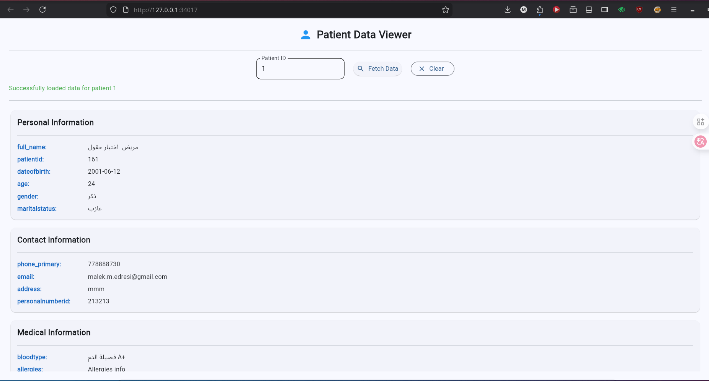

Here's the updated README with a screenshot section added:

```markdown
# Patient Data Viewer - Flet Application for Oracle APEX

A desktop/web application built with Python and Flet to fetch and display patient data from an Oracle APEX ORDS API endpoint. The application provides a clean, responsive interface for viewing patient information in categorized cards.

## Features

- **Modern UI**: Clean interface with categorized patient information cards
- **Real-time Data Fetching**: Retrieve patient data from ORDS API by ID
- **Flexible API Configuration**: Configurable API URL via environment variable
- **Error Handling**: Comprehensive error messages for connection and data issues
- **Responsive Design**: Adjusts to different screen sizes with scrolling support
- **Multiple Display Formats**: Shows data in categorized cards or raw format
- **Cross-platform**: Runs as desktop app or in web browser

## Screenshot



*The application running in VS Code with the terminal showing startup messages and the main.py file open.*

## Prerequisites

- **Operating System**: Ubuntu 22.04+, Windows 10+, or macOS 10.15+
- **Python**: 3.8 or higher (3.12+ recommended)
- **Oracle APEX ORDS**: Server running (default: `https://localhost:8443`)
- **Network Access**: Access to the ORDS API endpoint

## Installation

### 1. Clone or Download the Project
```bash
git clone <your-repository-url>
cd project-app-flet-for-oracle-apex
```

### 2. Set Up Virtual Environment (Recommended)
```bash
# Create virtual environment
python3 -m venv venv

# Activate virtual environment
# On Linux/macOS:
source venv/bin/activate
# On Windows:
venv\Scripts\activate

# Install required packages
pip install flet requests
```

### 3. Configure API Endpoint (Optional)
By default, the app uses `https://localhost:8443/ords/medical_sys_api`. To change this:
```bash
# Linux/macOS:
export API_URL="https://your-server:port/ords/your_path"

# Windows Command Prompt:
set API_URL=https://your-server:port/ords/your_path

# Windows PowerShell:
$env:API_URL="https://your-server:port/ords/your_path"
```

### 4. Run the Application
```bash
# Run in web browser mode (default)
python3 main.py

# Run as desktop application
python3 main.py --view desktop
```

## Project Structure

```
project-app-flet-for-oracle-apex/
├── main.py              # Main application file with UI and logic
├── README.md           # This documentation
├── requirements.txt    # Python dependencies (optional)
├── screenshot/         # Directory containing application screenshots
│   └── return_Data.png # Application screenshot
└── venv/               # Virtual environment (created during setup)
```

## API Configuration

### Default Endpoint
The app connects to the following ORDS API endpoint by default:
```
https://localhost:8443/ords/medical_sys_api/basic_sec_api/basic_sec_view_r_profile_patient/{patient_id}
```

### Custom Endpoint
Set the `API_URL` environment variable to use a different base URL. The complete endpoint will be:
```
{API_URL}/basic_sec_api/basic_sec_view_r_profile_patient/{patient_id}
```

### Expected API Response Format
The application handles multiple response formats:
```json
// Format 1: With 'items' array
{
  "items": [
    {
      "full_name": "John Doe",
      "patientid": "P12345",
      "dateofbirth": "1985-03-15",
      "age": 39,
      "gender": "Male",
      "maritalstatus": "Married",
      "phone_primary": "+1234567890",
      "email": "john.doe@email.com",
      "address": "123 Main St, City, Country",
      "personalnumberid": "ID789012",
      "bloodtype": "O+",
      "allergies": "Penicillin, Peanuts",
      "chronicdiseases": "Hypertension",
      "currentmedications": "Lisinopril 10mg daily",
      "emergencycontactname": "Jane Doe",
      "emergencycontactphone": "+0987654321"
    }
  ]
}

// Format 2: With 'data' array
{
  "data": [
    // patient objects
  ]
}

// Format 3: Direct array or object
[
  // patient objects
]
```

## Application Interface

### Main Components
1. **Header**: Application title with person icon
2. **Input Section**:
   - Patient ID text field (default: "1")
   - "Fetch Data" button with search icon
   - "Clear" button to reset display
   - Loading progress ring
3. **Status Area**: Shows fetch status and error messages
4. **Data Display**: Categorized cards showing patient information

### Data Categories
The application organizes data into four main categories:
1. **Personal Information**: Name, ID, DOB, Age, Gender, Marital Status
2. **Contact Information**: Phone, Email, Address, Personal Number ID
3. **Medical Information**: Blood Type, Allergies, Chronic Diseases, Medications
4. **Emergency Contact**: Emergency contact name and phone

## Usage Guide

### Basic Usage
1. **Start the Application**: Run `python3 main.py` in your terminal
2. **Enter Patient ID**: Type a patient ID in the input field (default is "1")
3. **Fetch Data**: Click the "Fetch Data" button or press Enter
4. **View Results**: Patient information appears in categorized cards
5. **Clear Display**: Click "Clear" to reset the interface

### Advanced Features
- **Web Browser Mode**: Default mode opens in your default web browser
- **Desktop Mode**: Use `--view desktop` flag for native desktop window
- **Custom API**: Set `API_URL` environment variable for different servers
- **SSL Handling**: SSL verification is disabled for development (self-signed certificates)

## Troubleshooting

### Common Issues

1. **"ModuleNotFoundError: No module named 'flet'"**
   ```bash
   # Ensure virtual environment is activated
   source venv/bin/activate  # Linux/macOS
   venv\Scripts\activate     # Windows
   
   # Reinstall packages
   pip install flet requests
   ```

2. **Connection Errors**
   - Verify ORDS server is running
   - Check API endpoint in browser: `https://localhost:8443/ords/medical_sys_api/basic_sec_api/basic_sec_view_r_profile_patient/1`
   - Ensure no firewall is blocking the connection
   - For self-signed certificates, SSL verification is already disabled

3. **"externally-managed-environment" Error (Ubuntu)**
   ```bash
   # Always use virtual environment on Ubuntu 23.10+
   python3 -m venv venv
   source venv/bin/activate
   pip install flet requests
   ```

4. **No Data Displayed**
   - Check API response format matches expected structure
   - Verify patient ID exists in the database
   - Look for error messages in the status area

5. **Application Doesn't Launch**
   - Ensure Python 3.8+ is installed: `python3 --version`
   - Check all dependencies are installed
   - Try running with `--view desktop` flag

### Development Notes

- **SSL Verification**: Disabled for localhost development to handle self-signed certificates
- **Virtual Environment**: Recommended for package management across all platforms
- **Response Flexibility**: Handles multiple API response formats
- **Error Recovery**: Clear error messages help diagnose connection and data issues

## Technical Details

- **Framework**: [Flet](https://flet.dev/) - Python UI framework
- **HTTP Client**: [Requests](https://docs.python-requests.org/) library
- **Python Version**: 3.8+ (3.12+ recommended)
- **Platform**: Cross-platform (Windows, macOS, Linux)
- **Modes**: Web browser (default) or desktop application

## Code Structure

The application follows a simple MVC-like structure:

1. **PatientViewer Class**: Handles API communication
2. **Main Function**: Sets up the Flet page and UI
3. **UI Components**: Modular functions for creating interface elements
4. **Event Handlers**: Functions for button clicks and data fetching

## Security Notes

⚠️ **Important Security Considerations:**

1. **SSL Verification**: Currently disabled for development. For production:
   - Enable SSL verification
   - Use valid certificates
   - Consider implementing certificate pinning

2. **API Security**:
   - The application assumes the API has proper authentication
   - Consider adding API key/token support for production use
   - Store credentials in environment variables, not in code

3. **Data Privacy**:
   - Patient data is sensitive information
   - Ensure compliance with healthcare data regulations (HIPAA, GDPR, etc.)
   - Consider implementing local data encryption

## Extending the Application

### Adding New Fields
To display additional patient fields:
1. Add the field name to the appropriate category list in `display_data()` function
2. The application will automatically display any field present in the API response

### Customizing UI
- Modify colors in `ft.Colors` constants
- Adjust spacing in container padding values
- Change card layout by modifying the `create_simple_row()` function

### Supporting Different APIs
The application can be adapted for other APIs by:
1. Modifying the `PatientViewer.get_data()` method
2. Adjusting the `display_data()` function to parse different response formats
3. Updating the API endpoint configuration

## Support

For issues or questions:

1. **Check Troubleshooting**: Review the troubleshooting section above
2. **Verify API Access**: Test the API endpoint directly in a browser or curl
3. **Environment Setup**: Ensure Python and virtual environment are properly configured
4. **Flet Documentation**: Visit [flet.dev/docs](https://flet.dev/docs) for UI framework help

## License

This project is for educational and demonstration purposes. Modify as needed for your requirements.

## Contributing

Feel free to:
1. Fork the repository
2. Create feature branches
3. Submit pull requests with improvements
4. Report issues and bugs

---

*Last Updated: Based on current code implementation*
*Application Version: 1.0*
```