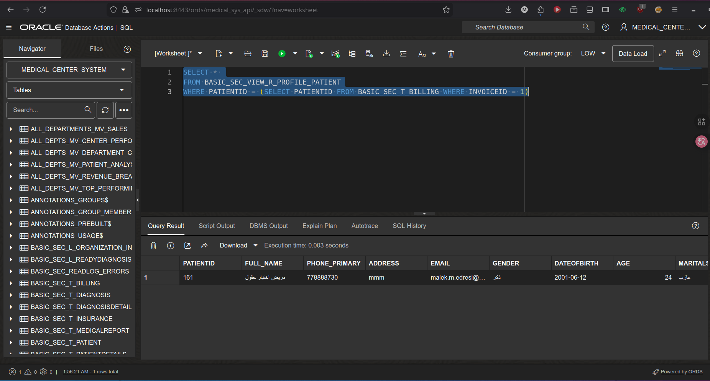
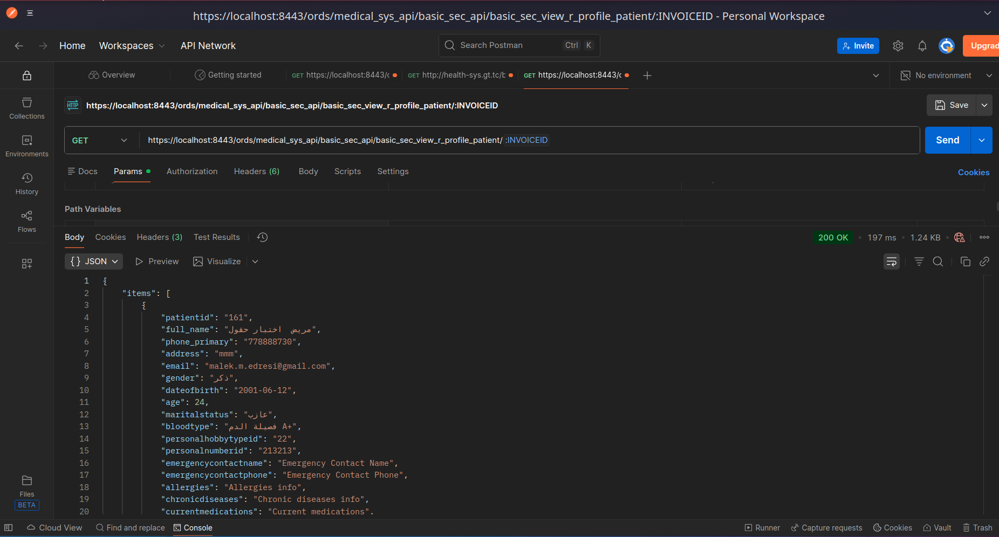

# Patient Data Viewer - Flet Application for Oracle APEX & Autonomous Database

## Overview

A modern desktop/web application built with Python and Flet that provides seamless access to patient data stored in **Oracle Autonomous Database with AI (26ai)** and served through **Oracle APEX ORDS REST APIs**. This application bridges the gap between enterprise database systems and user-friendly interfaces.


*Application interface showing categorized patient information*

## Architecture Overview

### Database & API Integration
```
Oracle Autonomous Database (26ai) → APEX ORDS REST API → Flet Application → User
```

### Components:
1. **Oracle Autonomous Database with AI (26ai)**: Stores patient data with AI-powered optimization
2. **APEX RESTful Services**: Exposes data via secure ORDS endpoints
3. **Flet Application**: Cross-platform UI with real-time data fetching
4. **Postman Testing**: API validation and testing tool

## System Flow Visualization

### Database Schema

*Oracle Autonomous Database schema showing patient data structure*

### API Testing

*API endpoint testing and validation using Postman*

## Oracle APEX Integration Features

### Direct ORDS API Connection
- **Endpoint**: `ords/medical_sys_api/basic_sec_api/basic_sec_view_r_profile_patient/{patient_id}`
- **Authentication**: Supports APEX session-based and basic authentication
- **Response Formats**: Handles multiple JSON structures (`items[]`, `data[]`, direct objects)
- **SSL/TLS**: Configurable certificate validation for development/production

### Oracle Autonomous Database 26ai Advantages
- **AI-Powered Queries**: Leverages Oracle's built-in machine learning for optimized data retrieval
- **Auto-scaling**: Handles varying loads without manual intervention
- **Built-in Security**: Always-free encryption and automated patching
- **APEX Integration**: Native REST service generation from database objects

## 🚀 Quick Setup & Configuration

### 1. Prerequisites
```bash
# Oracle Autonomous Database (26ai) instance
# APEX workspace with RESTful services enabled
# Python 3.8+ with Flet and Requests
```

### 2. Environment Configuration
```bash
# APEX ORDS Endpoint
export API_URL="https://[your-apex-instance].oraclecloudapps.com/ords/[workspace]/"

# Optional: API Authentication
export APEX_USERNAME="your_username"
export APEX_PASSWORD="your_password"
```

### 3. Run Application
```bash
# Install dependencies
pip install flet requests

# Launch application
python main.py --view desktop  # Desktop mode
# or
python main.py                 # Web browser mode
```

## Data Flow & Processing

### From Database to Display:
1. **Oracle Autonomous Database (26ai)**: AI-optimized data storage
2. **APEX REST Module**: Secure data exposure via `basic_sec_api`
3. **ORDS Endpoint**: RESTful service with JSON response
4. **Flet Application**: Data parsing and categorization
5. **UI Components**: Organized display in categorized cards

### Supported Data Categories:
- **Personal Information**: Patient demographics
- **Contact Details**: Communication channels
- **Medical Records**: Health-related data
- **Emergency Contacts**: Critical contact information

## Development & Customization

### Extending for Autonomous Database AI Features:
```python
# Example: Adding AI-powered data insights
def analyze_patient_trends(patient_data):
    # Leverage Oracle 26ai ML models
    # Implement predictive analytics
    # Add health risk assessments
    pass
```

### Integration Enhancements:
1. **Real-time Notifications**: Using Oracle Database Advanced Queuing
2. **AI Analytics**: Integrate Oracle Machine Learning models
3. **Automated Reporting**: Schedule APEX REST calls
4. **Multi-tenant Support**: Configure for multiple APEX workspaces

## Security Implementation

### Authentication Methods:
1. **APEX Session Tokens**: Maintain APEX application sessions
2. **ORDS Basic Authentication**: Simple username/password
3. **OAuth2.0**: For production deployments
4. **API Keys**: Managed through APEX RESTful Services

### Data Protection:
- **SSL Encryption**: All communications encrypted
- **Input Validation**: Patient ID sanitization
- **Error Handling**: No sensitive data in error messages
- **Environment Variables**: Secure credential storage

## Performance Optimization

### Leveraging Oracle 26ai Features:
- **Automatic Indexing**: AI-driven query optimization
- **In-Memory Processing**: Faster data retrieval
- **JSON Collections**: Native JSON support in Autonomous Database
- **Connection Pooling**: Efficient APEX ORDS connections

### Application-Level Optimizations:
- **Caching**: Store frequently accessed patient data
- **Batch Processing**: Handle multiple patient IDs
- **Lazy Loading**: Load data categories on demand
- **Progress Indicators**: Real-time fetch status

## Use Cases

### Healthcare Scenarios:
1. **Clinical Viewing**: Quick patient data access during consultations
2. **Administrative Tasks**: Patient information management
3. **Emergency Access**: Rapid retrieval in critical situations
4. **Remote Monitoring**: Off-site patient data viewing

### Enterprise Integration:
1. **Legacy System Bridge**: Connect older systems via APEX REST
2. **Mobile Access**: Responsive design for tablet/phone use
3. **Reporting Tool**: Data extraction for analysis
4. **Training Environment**: Safe patient data demonstration

## Support & Contribution

### Developer
**Malek Mohammed Al-Edresi**  
Oracle Certified Professional | APEX Developer Specialist  
Specializing in Oracle Database Architecture, APEX Development, and Enterprise Integration

**Contact**: [LinkedIn Profile](https://www.linkedin.com/in/malek-al-edresi)  
**GitHub**: [malek-al-edresi](https://github.com/malek-al-edresi)

